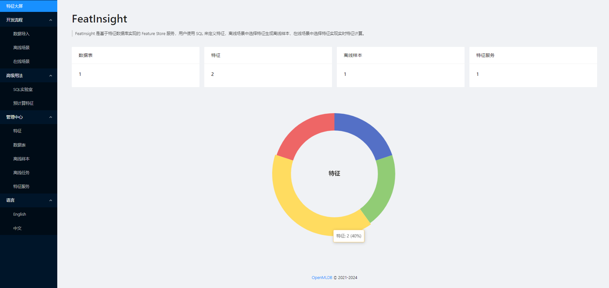

# FeatInsight - 基于 OpenMLDB 的特征平台

[FeatInsight 文档](https://openmldb.ai/docs/zh/main/app_ecosystem/feat_insight/index.html)

## 介绍

FeatInsight 是一个先进的特征计算和存储服务，利用 [OpenMLDB](https://github.com/4paradigm/OpenMLDB) 实现高效的特征计算、管理和编排。FeatInsight 提供简便易用的 UI 界面，用户可以进行机器学习特征开发的全流程，包括数据的导入、查看、编辑，特征的生成、存储、上线等功能。针对离线场景中，用户可以选择特征生成离线样本用于后续的机器学习开发；针对在线场景中，用户可以选择特征创建特征服务，实现实时特征计算。



FeatInsight 的主要目的是解决在机器学习项目中常见的问题，包括简便快捷地进行特征提取、转换、组合、选择以及血缘管理，特征的重用和共享，特征服务版本控制，以及确保在训练和推理过程中使用的特征数据的一致和可靠。应用场景包括 上线在线特征服务，搭建 MLOps工作流，搭建 FeatureStore平台，复用开源特征方案，以及作为机器学习业务组件应用于推荐系统、自然语言处理、金融医疗等领域机器学习落地方案中。

FeatInsight 提供的[主要功能](https://openmldb.ai/docs/zh/main/app_ecosystem/feat_insight/functions/index.html)包括：数据管理，特征管理，上线特征服务，离线样本导出，SQL实验室，预计算特征等。

## 安装部署

FeatInsight 提供多种部署方式，详情请参见[文档](https://openmldb.ai/docs/zh/main/app_ecosystem/feat_insight/install/index.html)

### Docker 镜像

准备配置文件并命名为 `application.yml`。

```
server:
  port: 8888
 
openmldb:
  zk_cluster: 127.0.0.1:2181
  zk_path: /openmldb
  apiserver: 127.0.0.1:9080
```

启动 Docker 容器。

```
docker run -d -p 8888:8888 -v `pwd`/application.yml:/app/application.yml registry.cn-shenzhen.aliyuncs.com/tobe43/featinsight
```

#### All-in-One 镜像
内置OpenMLDB部署以及配置文件的镜像。
```
docker run -d -p 8888:8888 registry.cn-shenzhen.aliyuncs.com/tobe43/portable-openmldb
```

### 安装包

准备配置文件`application.yml`。
```
wget https://openmldb.ai/download/featinsight/featinsight-0.1.0-SNAPSHOT.jar

java -jar ./featinsight-0.1.0-SNAPSHOT.jar
```


## 使用流程

使用任意网页浏览器访问 FeatInsight 服务地址 http://127.0.0.1:8888/ 。


FeatInsight 的大致使用流程如下：
1. 导入数据：使用 SQL 命令或前端表单进行创建数据库、创建数据表、导入在线数据和导入离线数据等操作。
2. 创建特征：使用 SQL 语句来定义特征视图，FeatInsight 将使用 SQL 编译器进行特征分析并创建对应的特征。
3. 离线场景：选择想要导入的特征，可以同时选择不同特征视图的特征，并使用分布式计算把样本文件导入到本地或分布式存储。
3. 在线场景：选择想要上线的特征，一键发布成在线特征抽取服务，然后可使用 HTTP 客户端进行请求和返回在线特征抽取结果。

我们提供了一个简单的例子来展示如何 FeatInsight 的具体使用流程，请参见[快速入门](https://openmldb.ai/docs/zh/main/app_ecosystem/feat_insight/quickstart.html)。

## 产品文档
更多内容请参考 [FeatInsight 产品文档](https://openmldb.ai/docs/zh/main/app_ecosystem/feat_insight/index.html)
