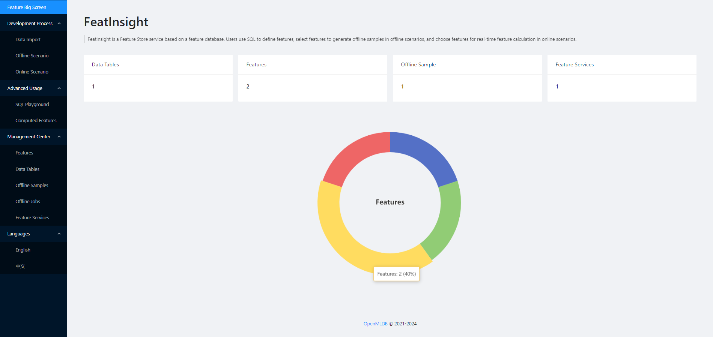

# FeatInsight - a Feature Platform Based on OpenMLDB

* [English Version](README.md)
* [中文版本](README-zh.md)

[Documentation](https://openmldb.ai/docs/zh/main/app_ecosystem/feat_insight/index.html)

## Introduction

FeatInsight is a feature computation and store platform, leveraging [OpenMLDB](https://github.com/4paradigm/OpenMLDB) for efficient feature computation, management and orchestration. FeatInsight provides a user-friendly user interface, allowing users to perform the entire process of feature engineering for machine learning, including data import, viewing and update, feature generation, store and online deployment. For offline scenarios, user can choose features for training sample generation for ML training; for online scenarios, user can deploy online feature services for real-time feature computations.



The main objective for FeatInsight is to tackle engineering problems in the process of machine learning, provide a convenient tool for users to perform feature extraction


The main objective of FeatInsight is to address common challenges in machine learning development, including facilitating easy and quick feature extraction, transformation, combination, and selection, managing feature lineage, enabling feature reuse and sharing, version control for feature services, and ensuring consistency and reliability of feature data used in both training and inference processes. Application scenarios include deploying online feature services, building MLOps workflows, establishing FeatureStore platforms, reusing open-source feature solutions, and using it as a business component in applications such as recommendation systems, natural language processing, finance, healthcare, and other areas of machine learning implementation.

FeatInsight offers [key functionalities](https://openmldb.ai/docs/zh/main/app_ecosystem/feat_insight/functions/index.html) including data management, feature management, online feature services deployment, offline samples generation, SQL Playground, pre-computed features, and more.


## Installation and Deployment

FeatInsight provides multiple ways for deployment. For more details, please refer to the [documentation](https://openmldb.ai/docs/zh/main/app_ecosystem/feat_insight/install/index.html).

### Docker

Prepare configuration file and name it as `application.yml`.

```
server:
  port: 8888
 
openmldb:
  zk_cluster: 127.0.0.1:2181
  zk_path: /openmldb
  apiserver: 127.0.0.1:9080
```

Start Docker container.

```
docker run -d -p 8888:8888 -v `pwd`/application.yml:/app/application.yml registry.cn-shenzhen.aliyuncs.com/tobe43/featinsight
```

#### All-in-One Image
This image additionally includes a portable OpenMLDB deployment and configuration files, good for testing purposes. 
```
docker run -d -p 8888:8888 registry.cn-shenzhen.aliyuncs.com/tobe43/portable-openmldb
```

### Installation Package

Prepare configuration file `application.yml`.

```
wget https://openmldb.ai/download/featinsight/featinsight-0.1.0-SNAPSHOT.jar

java -jar ./featinsight-0.1.0-SNAPSHOT.jar
```


## Usage

FeatInsight service can be accessed using any web browser at http://127.0.0.1:8888/.

The general usage process is as follows:
1. Importing Data: Create databases, create data tables, import online data, and import offline data using SQL commands or frontend forms.
2. Creating Features: Define feature views using SQL statements. FeatInsight will use a SQL compiler to analyze the features and create corresponding entities.
3. Offline Scenario: Select the desired features to import. You can choose features from different feature views simultaneously and use distributed computing to import sample files into local or distributed storage.
4. Online Scenario: Select the desired features to go live. Publish them as an online feature extraction service with one click, and then use an HTTP client to request and return online feature extraction results.

We provide a comprehensive guide using dummy data to show a whole usage process, please refer to [QuickStart](https://openmldb.ai/docs/zh/main/app_ecosystem/feat_insight/quickstart.html).
